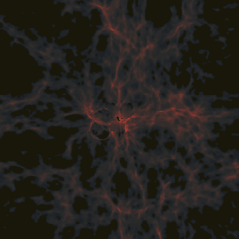
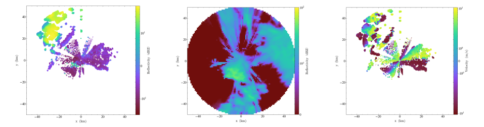

<!-- .slide: class="titleslide" -->

# Investigator Updates
<div style="height: 6.0em;"></div>
## Matthew Turk
## DDD Investigator Symposium 2019
<p style="text-align: right;">`mjturk@illinois.edu`</p> 

---

# Collaborative Effort

<div class="mediumtext">
<p>Before beginning, I want to acknowledge collaborators (students, postdocs,
research scientists and faculty members), whose work I am going to present.
Wherever possible I have identified the collaborating individual on the
appropriate slides, but I acknowledge I have likely passed some over.</p>

<p>Additionally, this work is enabled by a host of open-source software, without
which it would have been completely impossible.  This includes the python
ecosystem as well as a wealth of scientific software.</p>
</div>

---

# Collaborators 

<div class="multiCol">
<div class="col">
<ul>
<li style="decoration: none;"><b>Students</b></li>
<li> Alex Gagliano</li>
<li> Colleen Heinemann</li>
<li> Wei-Ting Liao</li>
<li> Xinyang Lu</li>
<li> Kwok-Sun Tang</li>
<li> Cassidy Wagner</li>
<li> Samantha Walkow</li>
</ul>
</div>
<div class="col">
<ul>
<li style="decoration: none;"><b>Postdocs</b></li>
<li>Jared Coughlin</li>
<li>Madicken Munk</li>
</ul>
<p></p>
<ul>
<li style="decoration: none;"><b>Research Scientists</b></li>
<li>Nathan Goldbaum</li>
<li>Kacper Kowalik</li>
<li>Meagan Lang</li>
</ul>
<p></p>
<ul>
<li style="decoration: none;"><b>Faculty</b></li>
<li> Amy Marshall-Colon</li>
<li> Hsi-Yu Schive</li>
</ul>
</div>
</div>

---

## The Prompt

 * Your field: What are the important questions? What are you doing to move the field forward?
 * New discovery: What new science are you exploring?
 * Tool/method: What new tool or method are you working on that might be useful for others?
 * Challenge: What's a challenge you are facing?

---
## Important Questions

 * How can we improve fidelity of our training data in **astrophysics** and **crop sciences**? 
 * What techniques can we apply to data-rich, **dimensionally-reduced** datasets? 
 * Which conceptual frameworks can be applied to spatially-organized data analysis?
 * How can data sharing be accelerated?

---

## Improving Fidelity in Astrophysics

### The Big Picture

what can we understand about the origins of the elements that make up our
world?

---

## Improving Fidelity in Astrophysics

### The Medium Picture

Can we improve our simulations to put observations of the universe into
context?

---

## Improving Fidelity in Astrophysics

### The Pixel Picture

 * Improving chemical solution
 * Improving fluid structure solution
 * Identifying parameters of compressible turbulence

---

## Astro Collaborators

This work was done in collaboration with Hsi-Yu Schive, Kwok-Sun Tang, and Wei-Ting Liao.

---

## Chemistry

In the early universe, we have these species:

 * Hydrogen: ${\rm H}$, ${\rm H}^{+}$, ${\rm H}^{-}$
 * Helium: ${\rm He}$, ${\rm He}^{+}$, ${\rm He}^{++}$
 * Electrons: ${\rm e}^{-}$
 * Molecular Hydrogen: ${\rm H}\_{2}$, ${\rm H}\_{2}^{+}$

Within these, there are dozens of reactions operating on different time scales
and with different dependencies on density and temperature.

**This is the most time-intensive part of conducting simulations of primordial star formation.**

---

## Chemistry

We utilize symbolic mathematics and templating engines to generate networks of ODEs usable within conventional ODE solvers.

Over the past year, utilizing this technique, we have:

 * Moved RHS generation to GPU, reducing memory transfer and improving speed
 * Identified problematic phase spaces
 * Begun to explore perturbation against equilibrium solutions

The flexibility afforded during the DDD award has enabled an entirely new class
of chemical solvers to be implemented and utilized.

---

## Improving Fidelity in Astrophysics

Our interaction with astrophysical fluids is mediated by telescopes,
necessarily reducing the dimensionality of our perception.

To understand the properties of turbulent gas, we have begun training on
our *observations* in order to determine the *initial conditions*.

<p class="fragment">Our first results have been somewhat promising.  Our process:</p>

<ol>
<li class="fragment">Generate turbulent boxes with variety of spectral indices
for the density ($\gamma$) and velocity ($\beta$).</li>
<li class="fragment">(Soon) Simulate observation from multiple viewpoints.</li>
<li class="fragment">[training montage]</li>
</ol>

---

<div id="ppv_slices_vis"></div>

---

<div id="ppv1d_vis"></div>

---

<div id="predictions_vis"></div>

---

## Improving Fidelity in Crop Sciences

Climate change models predict unprecedented warming by the end of this century,
resulting in a temperature-related yield loss of 15% for corn and soybean.

How can we utilize computational biology and molecular breeding technologies to
develop crops that are highly productive under challenging environmental
conditions such as heat, water, and nutrient stress.

---

## Crop Collaborators

This work was done in collaboration with the Crops in Silico team, including
Meagan Lang and Amy Marshall-Colon.

[cropsinsilico.org](http://cropsinsilico.org/)

[github/cropsinsilico](https://github.com/cropsinsilico/)

---

<!-- .slide: data-background-image="images/crops_in_silico_diagram.svg" data-background-position="center right" data-background-size="auto 75%" -->

## Improving Fidelity in Crop Sciences

_(Disclaimer: I am not a biologist)_

<div class="multiCol">
<div class="col">
<p>In the biological literature there are genuinely thousands of plant and plant
component models that can be applied to different relevant processes.</p>

<p>For the most part, making these work together is really, really tricky.  The
`yggdrasil` framework, developed by Meagan Lang, is designed to provide
information-aware connections between different models.</p>
</div>
<div class="col">
&nbsp;
</div>
</div>

---

## WT: Data Sharing

The Whole Tale project is an open source implementation of computational
environment sharing.  Without question, my favorite part of Whole Tale has
finally been deployed.

The Whole Tale filesystem is able to synthesize data from many different
sources (including DataVerse, HTTP, Globus, local, WebDAV, and institutional
repositories), dynamically update accessible data during the course of a
session, and enable direct collaboration across projects and individuals.

Even in light of the massive advances in computational environments, and the
rich ecosystem (including Binder), this is the key enabling component that will
help to reduce the technical friction to so many projects.

<p class="fragment">(Also it is totally usable outside of Whole Tale)</p>

---

## WT: Demo

<p class="fragment">Haha, I'm kidding, I'm not going to demo this now.</p>

<p class="fragment">It's all online at [wholetale.org](https://wholetale.org) and documented at [wholetale.readthedocs.io](https://wholetale.readthedocs.io)</p>

---

## yt: Viz

<!-- .slide: data-background-image="images/widgyts_diagram.svg" data-background-size="75% auto" -->

---

## yt: Viz



<p style="text-align: center;">[tinyurl.com/y3fq92vr](https://tinyurl.com/y3fq92vr)</p>

---

## yt: Domain Contexts


<div class="multiCol">
<div class="col">
<ul>
<li>Jargon</li>
<li>Data formats</li>
<li>Operations</li>
</col>
<div class="col">
<p>
This last year we have engaged with the Advanced Radar Toolkit community, as
well as other familiar domains such as oceanography, seismology and weather.
</p>
</div>
</div>

---

## yt: Declarative Analysis

(This is the one I'm currently most excited about.)

Inspired by vega-lite and its family of projects, we have begun work on
developing a schema (informed by previous efforts) for declarative analysis of
volume-organized data.

```json
{
  'projection': {
    'dataSource': 'allData',
    'operation': {
      'max': {'field': 'density'}
     },
     'axis': 'x'
}
```

(plus wasm, plus data repositories, ...)

---

## Some Challenges

<p class="fragment">People leave.</p>

<p class="fragment">It's always obvious what leads to success, but it's easy to convince yourself you know (in advance)</p>

<p class="fragment">Engagement can be really emotionally taxing.</p>

---

## Book Recommendations

I always get lots out of book recommendations from you folks, so here are mine:

 * Radical Candor by Kim Scott (h/t Karthik Ram and Tracy Teal)
 * Bossfight: ZZT by Anna Anthropy
 * Lovecraft Country by Matt Ruff
 * Planetfall (series) by Emma Newman

---

<!-- .slide: class="titleslide" -->

# Thank you

<div style="height: 6.0em;"></div>
## Matthew Turk
<p style="text-align: right;">`mjturk@illinois.edu`</p> 

